# Restore File Share from Azure Backup to Another Storage Account

**There are 2 objectives with this lab:**
* Create Storage Account
* Backup and Restore Data

## Create Storage Account

In the first part of the lab, we need to create our new storage account. We've been through this plenty of times so go create a new storage account. I named mine `evstorageaccount5` and clicked create. 

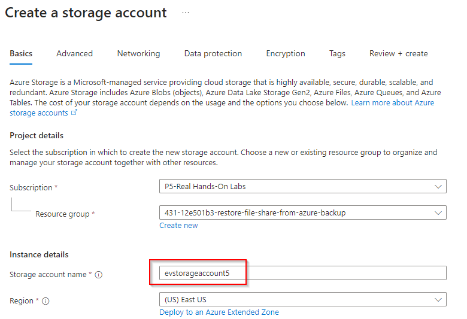

Next, create a file share in this storage account. I named my file share `fileshare1`.

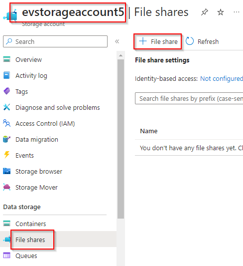

That completes the first half of this lab!

## Backup and Restore Data

For the second portion of this lab, we're going to actually start doing the backups. So firstly, lets go into the pre-configured storage account. Lets navigate to the file share that we are attempting to backup to our new file share, `fileshare1`. 

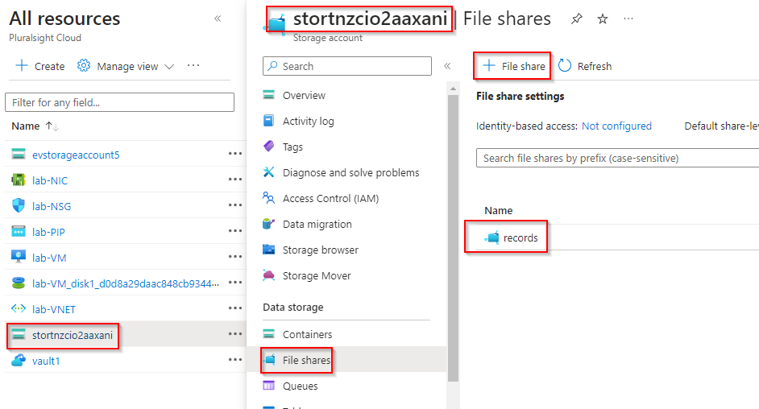

Once we're here, go to the lefthand side of the screen and click Browse. Here, we can see the CSV files that are located in the `records` file share. 

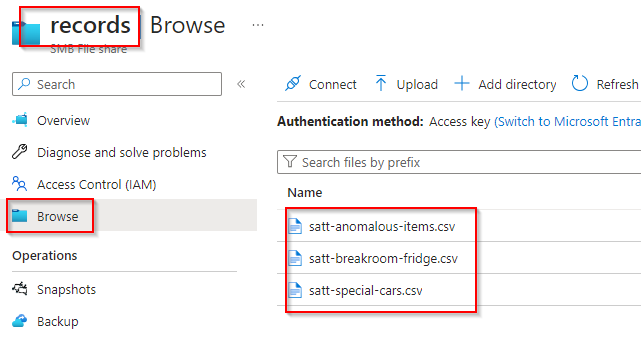

Now, lets navigate to our Recovery Services vault. In the lab, it's named `vault1`. Go to Getting started > Backup. We're going to select Azure file share as the type of resources we want to create and click Backup. 

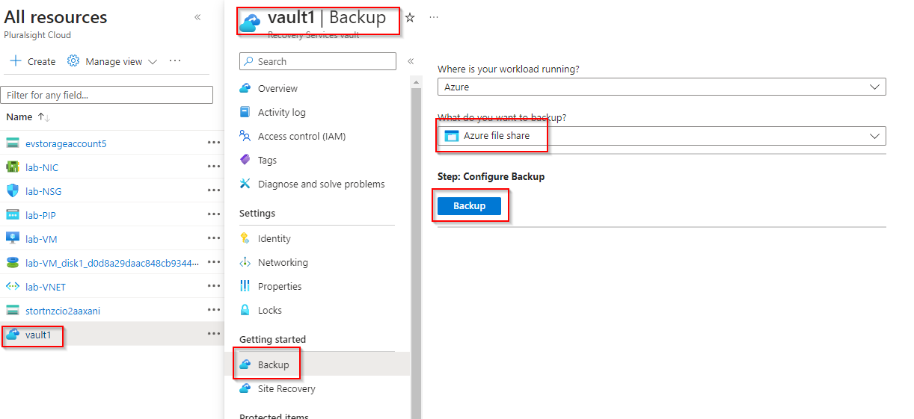

Now, we need to choose the pre-configured storage account and the fileshare we want to backup which is `records`. The lab instructed us to do daily backups but that was also pre-selected so we don't have to worry about that here. Click Create. 

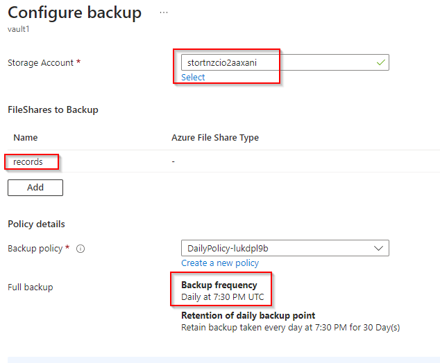

Now, lets go back to the `vault1` page and then navigate to Protected items > Backup items. You'll now see 2 items for Azure Storage (Azure FIles) which previously it was 0. Lets click on that. 

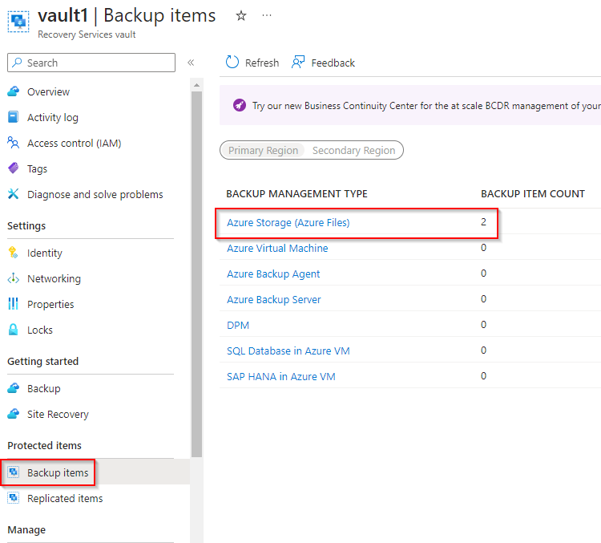

Locate the `records` item and go to the right of the screen. Click on the 3 dots and you'll see `Backup now`. Notice how the other options are greyed out (except Stop backup). Select Backup now. 

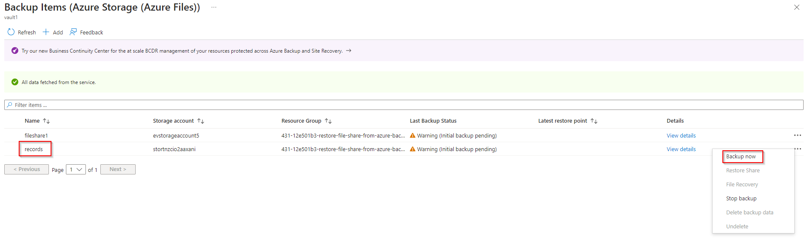

Once that is completed, you'll see the Last Backup Status changed to Success and when you click the three dots by `records`, you'll see we now have the option to Restore Share. Lets click on that. 

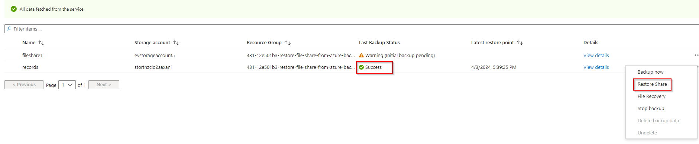

Follow the prompt. You have to choose a Restore Point which there was only one option for the timeslot. Now, choose the new file share that we created at the beginning of the lab. Remember, I named mine `fileshare1`. Now click Create. 

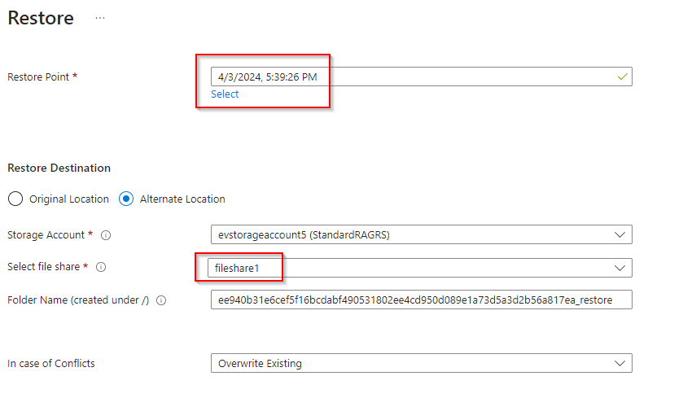

Once that is completed, navigate back to the newly created file share and click on Browse. You'll now see the files that were originally in the `records` file share. That means the backup was successful!

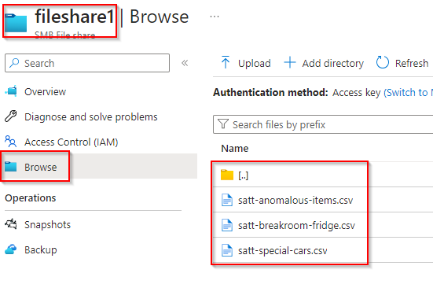

Lab completed!

## Personal Notes

Another straightforward lab. It was nice seeing another way of backing up data. You can never be too careful!

This lab also wasn't bad. I think it was cool just watching the storage account pop up in the VM. Feels like magic when these computers talk sometimes. It was nice to finally get my hands on SAS technology. I feel like I see SAS tokens all the time but have never worked with them. Anyway, cool.  
